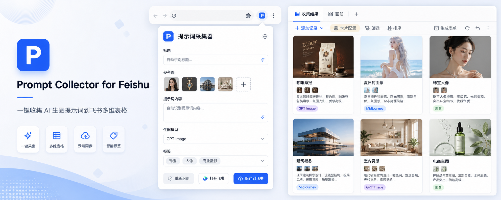
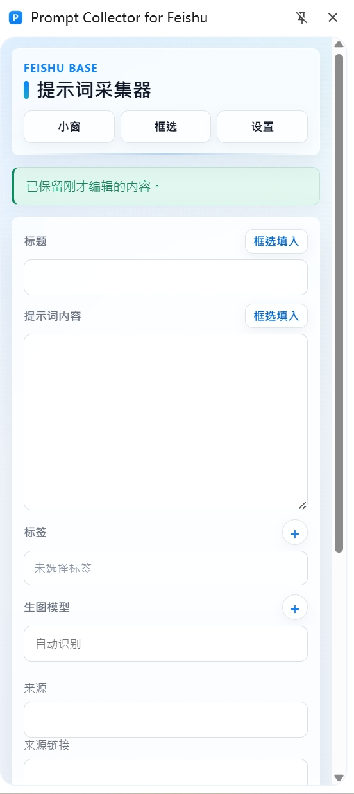
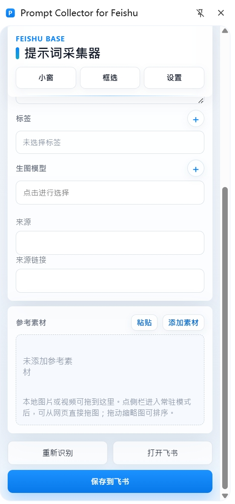

# Prompt Collector for Feishu

  <a href="#中文">中文</a> ·
  <a href="#english">English</a> ·
  <a href="#日本語">日本語</a>

---

## 中文

Prompt Collector for Feishu 是一个用于收集 AI 生图提示词的浏览器插件。它可以从网页内容中识别标题、提示词、参考素材、模型和标签，并将整理后的内容保存到指定的飞书多维表格中，方便后续检索、归档和复用。

### 插件截图

<table cellspacing="5" cellpadding="0">
  <tr>
    <td align="center">
      
    </td>
    <td align="center">
      
    </td>
  </tr>
</table>

### 使用说明

首次使用需要设置飞书应用和飞书多维表格，并关联到本插件，即可使用保存到飞书的功能。

具体设置方法见项目中的 [使用教程.docx](./使用教程.docx) 文件。

### License

Released under CC BY-NC-ND 4.0.

For personal non-commercial use only. No commercial use, no derivative redistribution.

仅个人非商业免费使用，禁止商用、禁止二次修改分发。

---

## English

Prompt Collector for Feishu is a browser extension for collecting AI image-generation prompts. It can extract titles, prompts, reference media, models, and tags from web pages, then save the organized content into a specified Feishu Base table for easier searching, archiving, and reuse.

### Usage

For first-time setup, configure your Feishu app and Feishu Base table, then connect them with this extension to enable saving records to Feishu.

See [使用教程.docx](./使用教程.docx) for the detailed setup guide.

### License

Released under CC BY-NC-ND 4.0.

For personal non-commercial use only. No commercial use, no derivative redistribution.

仅个人非商业免费使用，禁止商用、禁止二次修改分发。

---

## 日本語

Prompt Collector for Feishu は、AI 画像生成プロンプトを収集するためのブラウザ拡張機能です。Webページからタイトル、プロンプト、参考素材、モデル、タグを抽出し、整理した内容を指定した Feishu Base テーブルに保存できます。後から検索、整理、再利用しやすくするためのツールです。

### 使い方

初回利用時は、Feishu アプリと Feishu Base テーブルを設定し、この拡張機能と連携してください。設定後、収集した内容を Feishu に保存できるようになります。

詳しい設定方法は、プロジェクト内の [使用教程.docx](./使用教程.docx) を参照してください。

### License

Released under CC BY-NC-ND 4.0.

For personal non-commercial use only. No commercial use, no derivative redistribution.

仅个人非商业免费使用，禁止商用、禁止二次修改分发。
